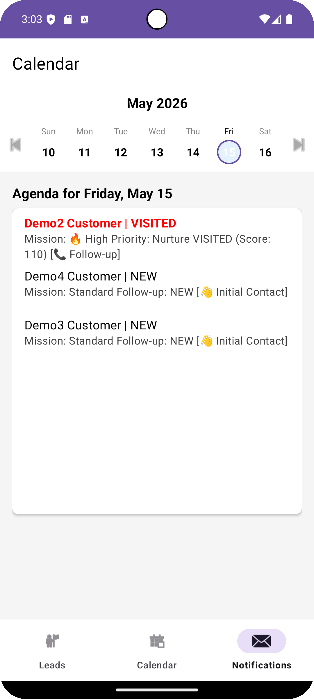
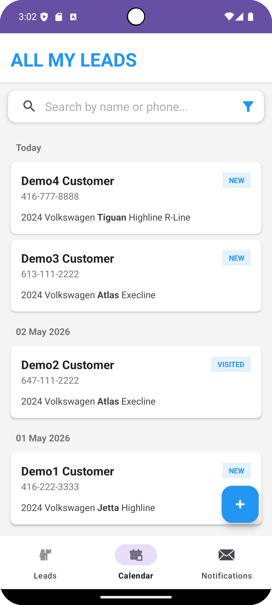
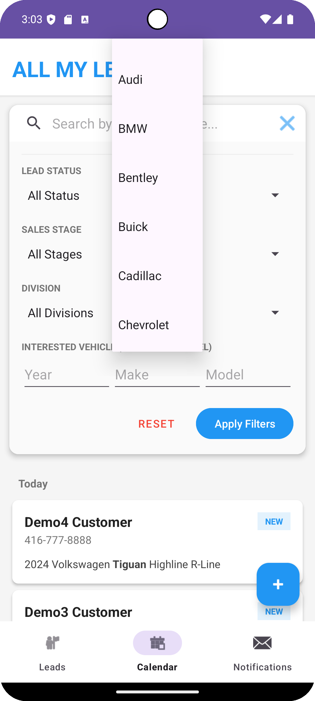
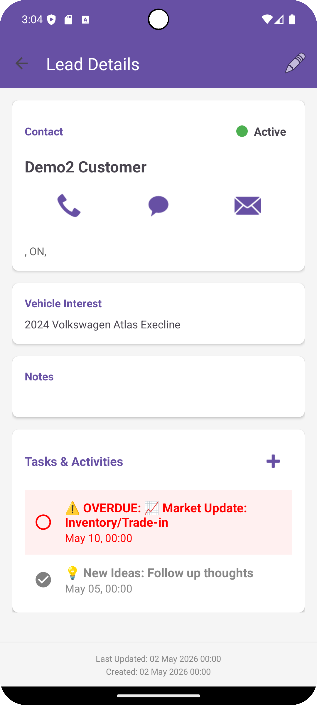
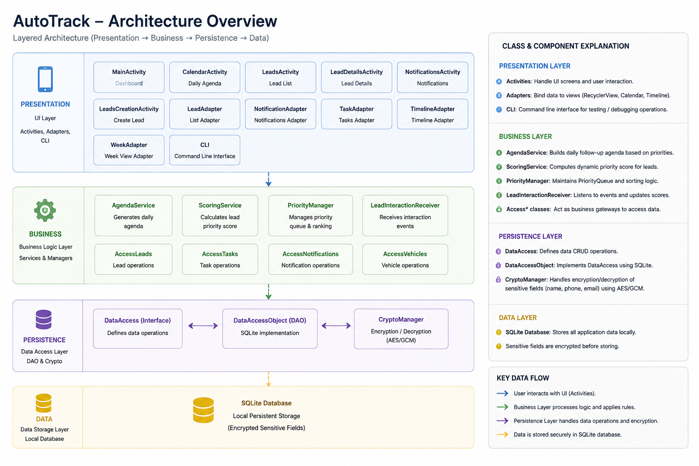

# AutoTrack CRM

AutoTrack is a Customer Relationship Management (CRM) application designed for automotive sales workflows. The project was inspired by real dealership sales experience, where one of the most common challenges for sales representatives is determining which customers should be prioritized for follow-up and when those follow-ups should happen.

Unlike traditional static CRM systems, AutoTrack focuses on workflow prioritization and daily follow-up management. The system dynamically evaluates customer leads based on sales stage, interaction history, timing urgency, and engagement activity in order to help organize daily sales tasks more effectively.

The application was developed as a native Android project using Java and follows a layered architecture separating presentation, business logic, persistence, and object models.

---

## Features

### Lead Management

- Structured customer profiles
- Customer notes and interaction tracking
- Vehicle interest management
- Lead filtering and searching
- Follow-up scheduling

### Intelligent Lead Scoring

AutoTrack includes a centralized scoring engine that dynamically calculates lead priority based on:

- Sales stage
- Follow-up timing urgency
- Customer engagement activity
- Interaction history
- Budget and interest level

The scoring system is designed to help identify which leads require immediate attention and which customers are most likely to convert.

### Priority-Based Workflow

The application utilizes a PriorityQueue-based ranking system to:

- Surface high-priority leads
- Organize daily follow-up tasks
- Prevent missed customer opportunities
- Highlight urgent customer interactions

### Calendar & Daily Agenda

The Calendar module combines:

- Scheduled tasks
- Follow-up reminders
- High-priority lead suggestions
- Daily workflow organization

This allows sales representatives to plan their day around test drives, calls, deliveries, and negotiations while focusing on the leads identified by the system as the most valuable.

### Notifications & Events

AutoTrack includes event and notification logic that alerts users to:

- Upcoming follow-ups
- High-priority lead changes
- Escalation reminders
- Time-sensitive customer interactions

### Data Privacy & Security

The application implements field-level encryption for sensitive customer information, including:

- Customer names
- Phone numbers
- Email addresses

Encryption is handled inside the DAO / Persistence layer using Android Keystore and AES/GCM encryption.

Sensitive fields are encrypted before database insert or update operations and decrypted after query operations before returning data to the application layer.

The primary security goal is data-at-rest protection. If the local SQLite database file is accessed directly, sensitive customer information should not be readable in plain text.

---

## Architecture
AutoTrack follows a layered architecture in order to separate user interface logic, business rules, persistence operations, and data models.
### Layered Architecture
````
app/src/main/java/com/areonedev/autotrack/

├── business/
│    ├── ScoringService
│    ├── PriorityManager
│    ├── AgendaService
│    └── Access Controllers
│
├── objects/
│    ├── Lead
│    ├── Vehicle
│    ├── Task
│    └── Notification
│
├── persistence/
│    ├── DataAccess
│    ├── DataAccessObject
│    └── CryptoManager
│
└── presentation/
    ├── Activities
    ├── Fragments
    ├── Adapters
    └── UI Components

````
### Data Flow
The business layer is responsible for calculating lead scores, generating daily agenda items, and organizing lead priorities.
The persistence layer manages SQLite database operations and data storage.
````
User Interaction
        ↓
Presentation Layer
        ↓
Business Layer
        ↓
Persistence / DAO Layer
        ↓
SQLite Database
````
---
## Tech Stack
### Language & Platform
- Java

- Android SDK

- Android Studio

### Database
- SQLite
- DAO Pattern
- Local Offline Persistence

### UI Components
- RecyclerView
- Multi-View Types
- Material Design 3
- Calendar-based Agenda Views

### Security
Android Keystore
AES/GCM Encryption

### Tools & Technologies
- Git
- GitHub
- PriorityQueue Algorithms
- CSV Vehicle Import System

---
## Installation & Setup

### Option 1 — Install APK
1. Go to the GitHub Releases page
2. Download the latest APK release
3. Transfer APK to an Android device
4. Enable installation from unknown sources if necessary
5. Install and launch AutoTrack

### Option 2 — Run from Android Studio

#### Clone Repository
````
git clone https://github.com/PengyuW007/AutoTrack.git
````
---
## Running Environment

### Recommended environment:

- Android Studio Ladybug or newer
- Java 17+
- Android SDK API 34+
- Gradle version compatible with the project configuration

### Tested on:

- Android Emulator
- Android Physical Device

---
## Database

AutoTrack currently uses a local SQLite database:
- AutoTrack.db

### Main tables include:
- Leads
- Vehicles
- Tasks
- Notifications
---

## Future Development

Planned improvements include:

- Web platform support
- iOS platform support
- MySQL cloud synchronization backend
- Cross-platform account synchronization
- WebSocket real-time updates
- Push notification reminders
- Advanced analytics dashboard
- Algorithm- assisted follow-up recommendations
- Multi-user dealership collaboration support
---
## Application Screenshots
### Calendar Agenda

### Lead List

### Lead Filter

### Lead Detail

### Architecture Diagram


---
## Author

Developed by Pengyu Wang.

This project was built as a practical software engineering project inspired by real automotive sales workflow challenges and designed to bridge dealership workflow problems with mobile software solutions.